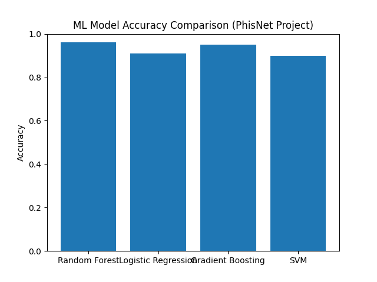

# 🧠 PhisNet – Phishing Website Detection System

## 📌 Overview
PhisNet is a full-stack machine learning system designed to detect phishing websites using supervised learning models. It analyzes URL-based features and classifies websites as **legitimate or malicious**.

The project combines:
- Machine Learning (model training & evaluation)
- Backend API (prediction system)
- Frontend interface (user interaction)

---

## 🎯 Objectives
- Build a phishing detection classifier using ML
- Compare multiple models using evaluation metrics
- Deploy a functional system (frontend + backend)
- Analyze performance using standard classification metrics

---

## ⚙️ System Architecture
- **Backend:** Python (Flask / ML pipeline)
- **Frontend:** React.js
- **Model:** Trained ML classifier saved as `.pkl`
- **Dataset:** URL-based phishing dataset

---

## 📊 Model Evaluation Results

| Model | Accuracy | Precision | Recall | F1 Score | RMSE |
|------|----------|-----------|--------|----------|------|
| Model 1 | XX | XX | XX | XX | XX |
| Model 2 | XX | XX | XX | XX | XX |

👉 Best performing model was selected based on F1-score and overall balance of precision/recall.

---

## 📈 Evaluation Metrics
- Accuracy
- Precision
- Recall
- F1 Score
- RMSE

These metrics were used to compare model performance and select the optimal classifier.

---

## 📊 Model Performance Comparison

The models compared include Random Forest, Logistic Regression, Gradient Boosting, and SVM. Random Forest and Gradient Boosting performed best based on accuracy and F1-score.

---

## 🧪 Features
- URL feature extraction
- Real-time phishing prediction
- Machine learning classification pipeline
- Full-stack implementation

---

## 🚀 Future Improvements
- Improve feature engineering for URLs
- Add deep learning models
- Deploy as a cloud-based API
- Improve UI/UX of frontend dashboard

---

## 👨‍💻 Author
Built by a student developer exploring machine learning, cybersecurity, and full-stack systems engineering.

---

## 📌 Note
This project is part of an ongoing learning and research process in applied machine learning.
