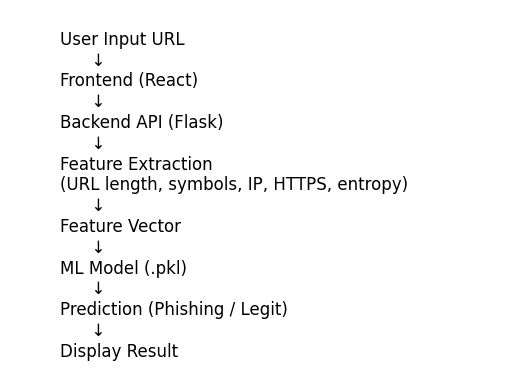
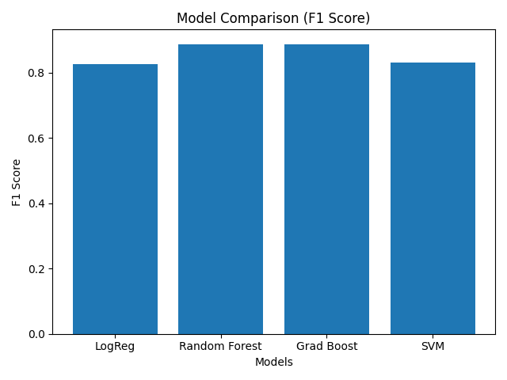

# 🧠 PhisNet – Phishing Website Detection System

## 📌 Overview
PhisNet is a full-stack machine learning system designed to detect phishing websites using supervised learning techniques. The system analyzes URL-based features and classifies websites as **legitimate (0)** or **phishing (1)**.

It integrates:
- Machine Learning (model training & evaluation)
- Backend API (prediction system)
- Frontend interface (user interaction)

---

## 🎯 Objectives
- Develop a phishing detection classifier using machine learning
- Perform comparative analysis of multiple models
- Evaluate performance using standard classification metrics
- Build a functional full-stack system for real-time prediction

---

## ⚙️ System Architecture

The system follows a structured pipeline:

1. User inputs a URL via the frontend  
2. Request is sent to the backend API  
3. Backend performs feature extraction on the URL  
4. Extracted features are converted into a numerical vector  
5. The trained ML model classifies the URL  
6. Result (Phishing / Legitimate) is returned to the user  

---

## 📊 Model Evaluation Results

| Model | Accuracy | Precision | Recall | F1 Score |
|------|----------|-----------|--------|----------|
| Logistic Regression | 0.807 | 0.789 | 0.868 | 0.827 |
| Random Forest | **0.879** | **0.874** | 0.901 | **0.888** |
| Gradient Boosting | 0.873 | 0.845 | **0.931** | 0.886 |
| SVM | 0.810 | 0.787 | 0.880 | 0.831 |

👉 **Best Model:** Random Forest (highest F1 Score and balanced performance)

---

## 📊 Model Performance Comparison

### 🔍 Key Insights
- **Random Forest** achieved the best overall performance (F1 Score: 0.888)
- **Gradient Boosting** achieved the highest recall (0.931), making it effective at detecting phishing URLs
- **Logistic Regression** and **SVM** served as baseline models for comparison

---

Dataset:
- 808,042 URLs (Kaggle dataset)
- Sampled 20,000 for training due to computational constraints
  
---

## 📈 Evaluation Metrics
The following metrics were used:

- **Accuracy** – Overall correctness of predictions  
- **Precision** – Correctness of phishing predictions  
- **Recall** – Ability to detect phishing URLs  
- **F1 Score** – Balance between precision and recall  

These metrics ensure a comprehensive evaluation of model performance.

---

## 🧪 Feature Engineering
The system extracts meaningful features from URLs, including:

- URL length  
- Number of special characters  
- Presence of HTTPS  
- IP address detection  
- Subdomain depth  
- Suspicious keywords (e.g., login, verify, secure)  
- Entropy (randomness of URL string)  

These features enable effective classification of phishing patterns.

---

## 🚀 Features
- URL-based phishing detection  
- Real-time prediction system  
- Machine learning model comparison  
- Full-stack implementation (React + Flask)  

---

## 🚀 Future Improvements
- Enhance feature engineering techniques  
- Incorporate deep learning models  
- Deploy as a cloud-based API  
- Improve frontend UI/UX  

---

## 👨‍💻 Author
Built by a student developer exploring machine learning, cybersecurity, and full-stack systems engineering.

---

## 📌 Note
This project is part of ongoing research in applied machine learning and cybersecurity.
